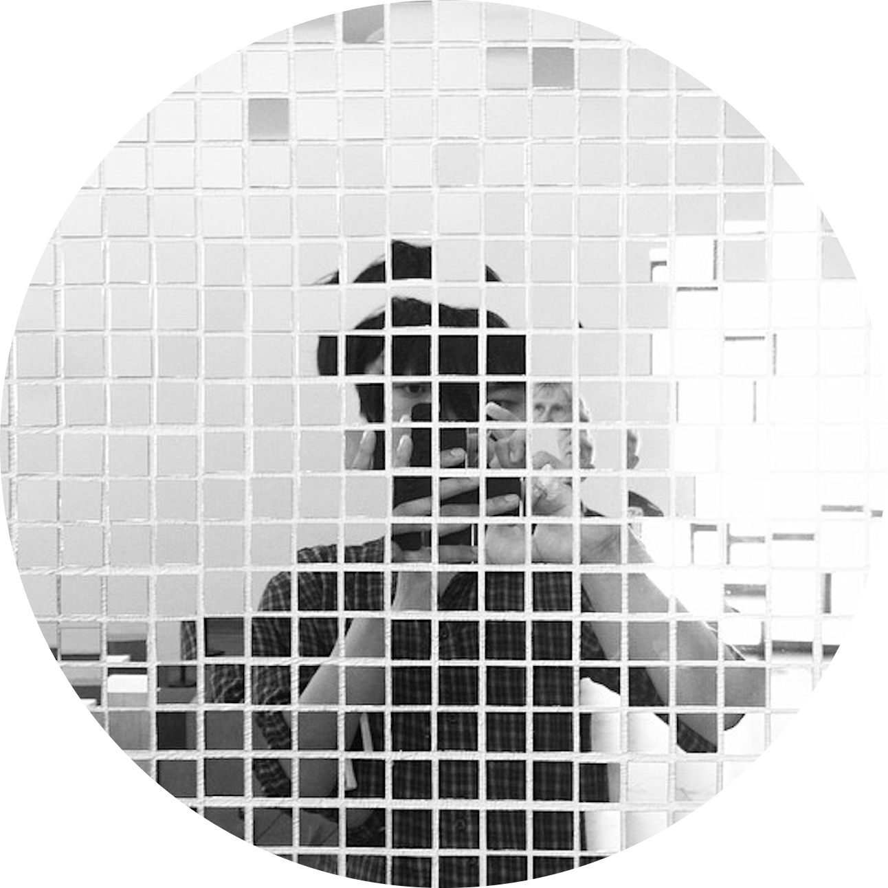

# _Yohei Inokuchi_

motivation : I'm interested in thinking about Future Life changed by bit technology.

## URL List
- [about Markdown](https://github.com/BioClub/Practice-Repository/blob/master/Reference.md)
- [MyPage](http://bha5.bioclub.org/participants/yohei/)
- [MyPage](https://inoyoh.github.io/BHA5/participants/yohei/)

## Memo

### ■ Work / week1-Sat (2018/02/03)
・あああ

### ■ ビデオ視聴 / week1-Fri (2018/02/02)
- Video track plant growth
- [DIY Bioprinting, JuicyPrint - London Biohack Space](http://makezine.jp/blog/2016/09/prototyping-with-living-cells.html)
- [Bio Growing](http://jp.techcrunch.com/2014/08/12/20140811glowing-plant-is-one-of-y-combinators-very-first-biotech-startups/)
- タコのソフトロボット

### ■ Work / week1-Tue (2018/01/30)
- バイオハックとは何か

