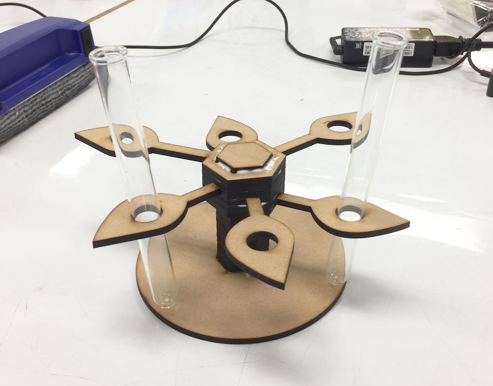
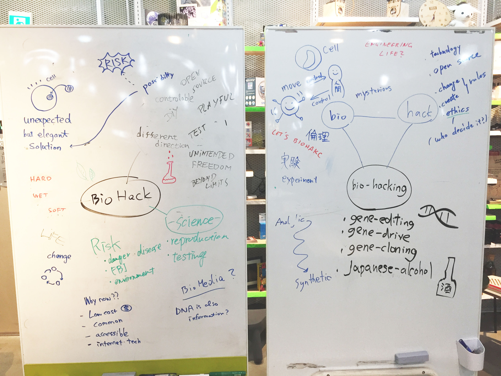

# Memo
## week2
### ■ Work / week2-Sat (2018/02/10)
- やったこと
  - バイオの読書（かしこい単細胞 粘菌 / 中垣俊之）
  - agar(寒天培地)の制作＋自分のバクテリアを乗っける

### ■ Video / week2-Thu (2018/02/08)
- [✍️Video Post - definition of death](http://bha5.bioclub.org/general/2018/02/10/definition_of_death.html)
- keyword
  - [terike haapoja. “entopy” 2004](http://www.av-arkki.fi/en/works/entropy/)
    - サーモグラフィーで馬が死んで行く様子を可視化した。
  - [Ivorish - nina van den broek](http://www.ivorish.org/)
    - 乳歯から象牙の素材を作るプロジェクト
    - 問題：象牙のために像が減っている。
  - [BioSteel Fiber](https://prtimes.jp/main/html/rd/p/000000324.000003301.html)
    - アディダスが、天然由来の完全に生分解可能なシューズを開発した。
  - [Fragrant Moss](https://orbellamoss.com/pages/about-orbella-fragrant-moss)
    - アロマ×テラリウム
    - 香りを育てる。
  - Pigmented bacteria    // 色素性細菌
    - いろんな色を作れる
  - Photobacterium phospherium    // 発行バクテリア
  - [Bioluminescent](http://biohackacademy.github.io/biofactory/class/1-incubator/bioluminescent-bacteria-isolation/) //生物発光   - 抵抗を入れる理由：抵抗を入れないと、エネルギーが熱に変わる。

## week1

### ■ Work / week1-Sat (2018/02/03)
- [✍️Video Post - glowing plants](http://bha5.bioclub.org/general/2018/02/03/glowing_plants.html)
- keyword
  - [Biota Beats](http://biotabeats.org/)
  - [ninja PCR](https://blog.adafruit.com/2017/03/23/ninjapcr-open-source-iot-dna-amplifier/)
- make the clean bench
 

- test tube stand
 

### ■ Video / week1-Fri (2018/02/02)
- keyword
  - Video track plant growth
  - [DIY Bioprinting, JuicyPrint - London Biohack Space](http://makezine.jp/blog/2016/09/prototyping-with-living-cells.html)
  - [Bio Glowing](http://jp.techcrunch.com/2014/08/12/20140811glowing-plant-is-one-of-y-combinators-very-first-biotech-startups/)
  - タコのソフトロボット ([Octobot](https://nge.jp/2016/09/08/post-134660))

### ■ Work / week1-Tue (2018/01/30)
- バイオハックとは何か
  - bio : move, mysterious, experiment, ...
  - hack : technology, open source, change(create) rules, ...
  - bio hack : create mysterious things !!
 

