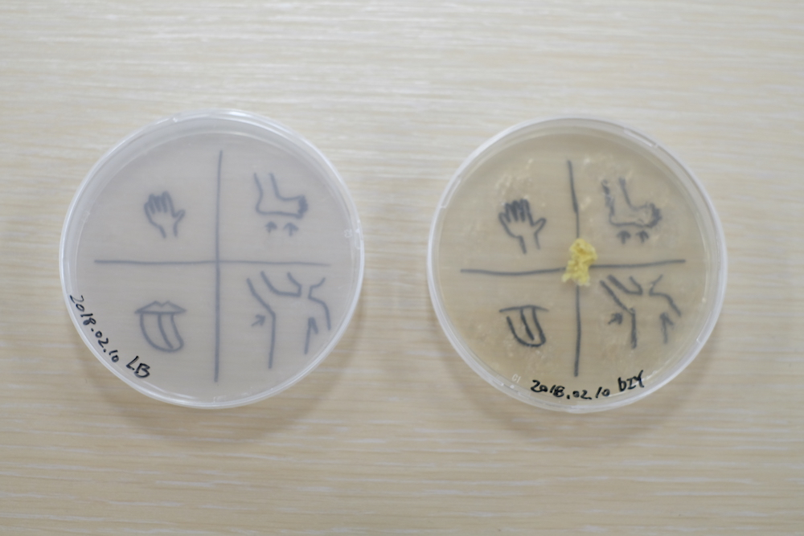
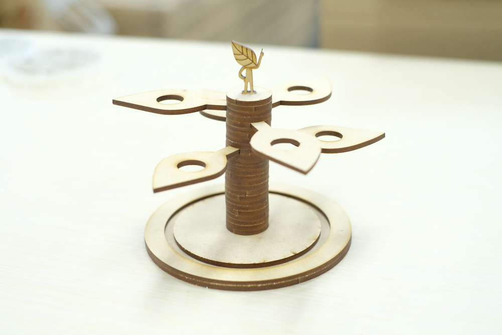

<table  border="1" cellspacing="0" cellpadding="5" bordercolor="#dfdfdf" style="border-collapse: collapse">
  <tr>
    <th>number</th>
    <th>name</th>
    <th>date</th>
    <th>image</th>
  </tr>
  <tr>
    <td>05</td>
    <td>agar of my bacteria and slime mold</td>
    <td>2018/02/10</td>
    <td></td>
  </tr>
  <tr>
    <td>04</td>
    <td>bio-kun</td>
    <td>2018/02/09</td>
    <td></td>
  </tr>
  <tr>
    <td>03</td>
    <td>test tube 02</td>
    <td>2018/02/09</td>
    <td></td>
  </tr>
  <tr>
    <td>02</td>
    <td>test tube 01</td>
    <td>2018/02/03</td>
    <td></td>
  </tr>
  <tr>
    <td>01</td>
    <td>clean bench</td>
    <td>2018/02/03</td>
    <td></td>
  </tr>
</table>

<!-- 参考

| 左揃え | 中央揃え | 右揃え |
|:---|:---:|---:|
|1 |2 |3 |
|4 |5 |6 |

-->
